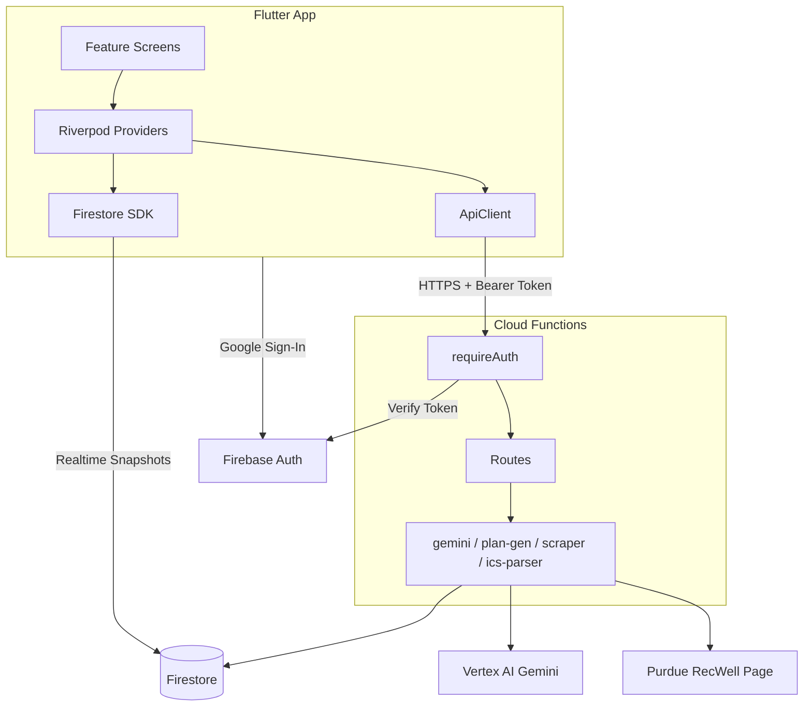

# AGENTS.md

> Navigational context for AI agents working in this repository.

## Table of Contents

- [Project Overview](#project-overview) — What this is and how it's structured
- [Directory Map](#directory-map) — Where to find things
- [Architecture](#architecture) — How components connect
- [Key Patterns](#key-patterns) — Non-obvious conventions and deviations
- [API Surface](#api-surface) — Backend endpoints
- [Data Authority](#data-authority) — Where schemas live and how they flow
- [Configuration & CI](#configuration--ci) — Config files, linters, workflows
- [Detailed Documentation](#detailed-documentation) — Where to find more
- [Custom Instructions](#custom-instructions) — Human/agent-maintained conventions

---

## Project Overview
<!-- Tags: #overview #identity -->

AI-powered fitness planning app for Purdue University students. pnpm monorepo with three packages:

| Package | Path | Stack |
|---------|------|-------|
| Mobile App | `apps/mobile/` | Flutter (Dart), Riverpod, GoRouter, Dio, Material 3 |
| Cloud Functions | `functions/` | Express, TypeScript, Vertex AI Gemini 2.0 Flash, Vitest |
| Shared Schemas | `packages/shared/` | Zod (single source of truth for data validation) |

**Firebase project:** `scab-purdue` — **Region:** `us-central1`

---

## Directory Map
<!-- Tags: #navigation #structure -->

```
/
├── apps/mobile/lib/
│   ├── app/              → App root (MaterialApp.router)
│   ├── features/         → Feature screens (auth, onboarding, home, today, schedule, chat, profile)
│   ├── models/           → Dart data classes (mirror Zod schemas)
│   ├── providers/        → Riverpod state (auth, profile, schedule, plan, chat, facility)
│   ├── services/         → ApiClient (Dio + auth interceptor)
│   └── shared/           → Router config, theme, utils
├── functions/src/
│   ├── index.ts          → Entry: exports single onRequest Cloud Function
│   ├── app.ts            → Express setup + route mounting
│   ├── middleware/auth.ts → Firebase ID token verification
│   ├── routes/           → Endpoint handlers (plan, chat, facility-usage, ics-import)
│   └── services/         → Business logic (gemini, plan-generator, facility-scraper, ics-parser)
├── packages/shared/src/
│   ├── schemas.ts        → All Zod schemas (THE source of truth)
│   └── index.ts          → Re-exports schemas + Firestore path constants
├── docs/                 → Human docs (ARCHITECTURE, SETUP, CONTRIBUTING, TASKS)
├── .github/workflows/    → CI (functions.yml, flutter.yml)
└── .agents/summary/      → Detailed AI documentation files
```

**Key entry points:**
- Flutter app starts at `apps/mobile/lib/main.dart`
- Cloud Functions entry is `functions/src/index.ts` → `app.ts`
- Schema changes start at `packages/shared/src/schemas.ts`

---

## Architecture
<!-- Tags: #architecture #data-flow -->



**Data access pattern:** The Flutter app reads schedule blocks and plans directly from Firestore (realtime), but writes/generation go through the Cloud Functions API.

---

## Key Patterns
<!-- Tags: #patterns #conventions #deviations -->

These deviate from defaults or are non-obvious:

1. **Single Cloud Function for all routes** — `functions/src/index.ts` exports one `onRequest` function that mounts an Express app. All endpoints share a single cold-start.

2. **Dual data access** — The app reads Firestore directly (realtime via `StreamProvider`) but uses the REST API for mutations that need server-side logic (plan generation, chat, ICS import).

3. **Dart models mirror Zod manually** — There's no cross-language codegen. When you change `packages/shared/src/schemas.ts`, you must manually update the corresponding Dart model in `apps/mobile/lib/models/`.

4. **GoRouter auth redirects** — `shared/routing/router.dart` uses a `_RouterNotifier` that listens to both `authStateProvider` and `userProfileProvider` to drive redirect logic (login → onboarding → home).

5. **Gemini context injection** — The chat service injects user context (profile, schedule, plan, facility data) as a synthetic first message pair before the actual conversation history. See `functions/src/services/gemini.ts`.

6. **Facility scraping with cache** — `GET /api/facility-usage` caches in Firestore document `cache/facilityUsage` with 5-minute TTL. If RecWell page HTML structure changes, update selectors in `functions/src/services/facility-scraper.ts`.

7. **`cloud_functions` Flutter package is unused** — Listed in pubspec.yaml but the app calls the API via Dio, not Firebase callable functions.

8. **Riverpod codegen** — `theme_provider.dart` uses `riverpod_generator` (produces `.g.dart` files). Run `flutter pub run build_runner build` after changes. Other providers use manual Riverpod patterns.

9. **Emulator testing** — `AuthService.signInWithEmulator()` provides email/password fallback (`test@purdue.edu` / `testtest`) for local development without Google OAuth.

---

## API Surface
<!-- Tags: #api #endpoints -->

All routes served under a single Cloud Function. Base URL pattern: `{host}/scab-purdue/us-central1/api`

| Method | Path | Auth | Purpose |
|--------|------|------|---------|
| GET | `/api/health` | No | Health check |
| GET | `/api/facility-usage` | No | Purdue RecWell occupancy (cached) |
| POST | `/api/plan/generate` | Yes | Generate daily workout plan |
| POST | `/api/chat` | Yes | AI fitness assistant (Gemini) |
| POST | `/api/schedule/import-ics` | Yes | Parse ICS calendar URL |

Auth = Firebase ID token as `Authorization: Bearer <token>`

---

## Data Authority
<!-- Tags: #schemas #firestore -->

**Schema source of truth:** `packages/shared/src/schemas.ts`

**Firestore structure:**
```
users/{uid}                    → UserProfile
users/{uid}/scheduleBlocks/{id} → ScheduleBlock
users/{uid}/plans/{date}        → DailyPlan
cache/facilityUsage             → {facilities[], cachedAt}
```

**Path constants:** Exported from `@ppt/shared` as `Collections` object.

**Security rules:** Owner-only for user data; any-authenticated-read for cache; Admin SDK bypasses for writes to cache.

---

## Configuration & CI
<!-- Tags: #config #ci #tooling -->

| File | Purpose |
|------|---------|
| `pnpm-workspace.yaml` | Monorepo packages: `functions/`, `packages/*` |
| `firebase.json` | Functions source, Firestore rules/indexes, emulator ports |
| `.firebaserc` | Project alias: `default` → `scab-purdue` |
| `firestore.rules` | Security rules (owner-only + cache read) |
| `firestore.indexes.json` | Composite indexes |
| `functions/.eslintrc.json` | Legacy ESLint config (being migrated to flat config) |
| `functions/eslint.config.mjs` | ESLint 9 flat config |
| `functions/.prettierrc` | Prettier: trailing commas, double quotes, 100 print width |
| `functions/vitest.config.ts` | Vitest test runner config |
| `apps/mobile/analysis_options.yaml` | Dart analyzer settings |

**CI Workflows (`.github/workflows/`):**
- `functions.yml` — Triggers on `functions/**` or `packages/shared/**` changes. Runs: install → build shared → lint → typecheck → test shared → test functions.
- `flutter.yml` — Triggers on `apps/mobile/**` changes. Runs: pub get → analyze → test.

**Emulator ports:** Auth=9099, Functions=5001, Firestore=8080, UI=4000 (all bound to `0.0.0.0`)

---

## Detailed Documentation
<!-- Tags: #references -->

For deeper context, see `.agents/summary/`:

| File | When to read |
|------|-------------|
| `index.md` | Start here — guides you to the right detailed file |
| `architecture.md` | System design, layered architecture, deployment |
| `components.md` | What each module/file does |
| `interfaces.md` | Full API contracts with examples |
| `data_models.md` | All schemas, Firestore structure, constants |
| `workflows.md` | End-to-end sequence diagrams for every feature |
| `dependencies.md` | All packages with versions and purpose |
| `review_notes.md` | Known gaps and recommendations |

---

## Custom Instructions

<!-- This section is maintained by developers and agents during day-to-day work.
     It is NOT auto-generated by codebase-summary and MUST be preserved during refreshes.
     Add project-specific conventions, gotchas, and workflow requirements here. -->
