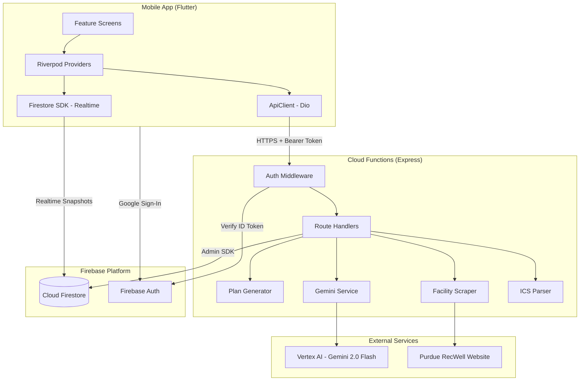
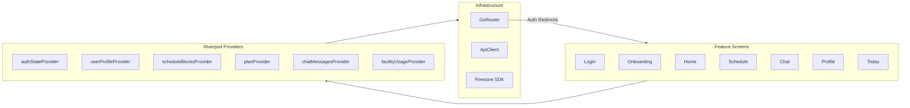
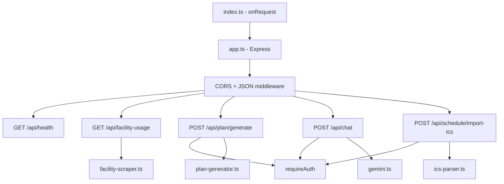
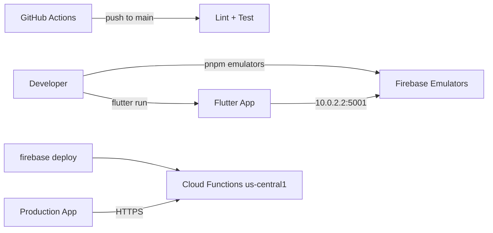

# Architecture

**Tags:** `#architecture` `#design-patterns` `#data-flow` `#decisions`

## System Overview

## Layered Architecture

### Client Layer (Flutter)

- **Feature-first organization:** Each feature has its own directory under `lib/features/`
- **Riverpod for state:** Mix of `StreamProvider` (Firestore realtime), `FutureProvider` (API calls), `AsyncNotifier` (complex state), and `StateNotifier` (chat)
- **GoRouter:** Declarative routing with auth-based redirects (login → onboarding → home)
- **ApiClient:** Dio-based HTTP client with `_AuthInterceptor` that auto-attaches Firebase ID tokens

### Backend Layer (Cloud Functions)

- **Single Cloud Function:** One `onRequest` handler serves all routes via Express
- **Auth middleware pattern:** `requireAuth` verifies Firebase ID tokens, attaches `uid` to request
- **Service layer:** Business logic isolated from route handlers
- **Validation:** Zod schemas from `@ppt/shared` validate all request bodies

### Data Layer (Firestore)
- **User-scoped data:** `users/{uid}` document + subcollections (`scheduleBlocks`, `plans`)
- **Cache pattern:** `cache/facilityUsage` with 5-minute TTL, writable only by Admin SDK
- **Security rules:** Owner-only access for user data; authenticated-read for cache; default deny

## Key Design Decisions

| Decision | Rationale |
|----------|-----------|
| Server-side Gemini only | API credentials never exposed to client devices |
| Zod shared schemas | Single source of truth; TypeScript types derived from runtime validators |
| Dart models mirror Zod manually | No cross-language codegen; kept in sync by convention |
| Riverpod over BLoC | Simpler API, compile-safe providers, less boilerplate |
| Single Cloud Function entry point | All routes share cold-start cost; simpler deployment |
| Express for routing | Familiar middleware pattern; easy to test in isolation |
| Firestore realtime for schedules | Instant UI updates without polling |
| Rule-based plan gen (Phase 1) | Deterministic, testable; Gemini upgrade planned for Phase 2 |

## Deployment Architecture

- **Local development:** Firebase Emulators (Auth, Functions, Firestore) + Flutter hot reload
- **CI:** GitHub Actions runs lint/typecheck/test on push and PR to `main`
- **Deployment:** Manual `firebase deploy --only functions` (no CD pipeline yet)

## Cross-References

- API contract details → [interfaces.md](interfaces.md)
- Component responsibilities → [components.md](components.md)
- Data structure specifics → [data_models.md](data_models.md)
- End-to-end flows → [workflows.md](workflows.md)
