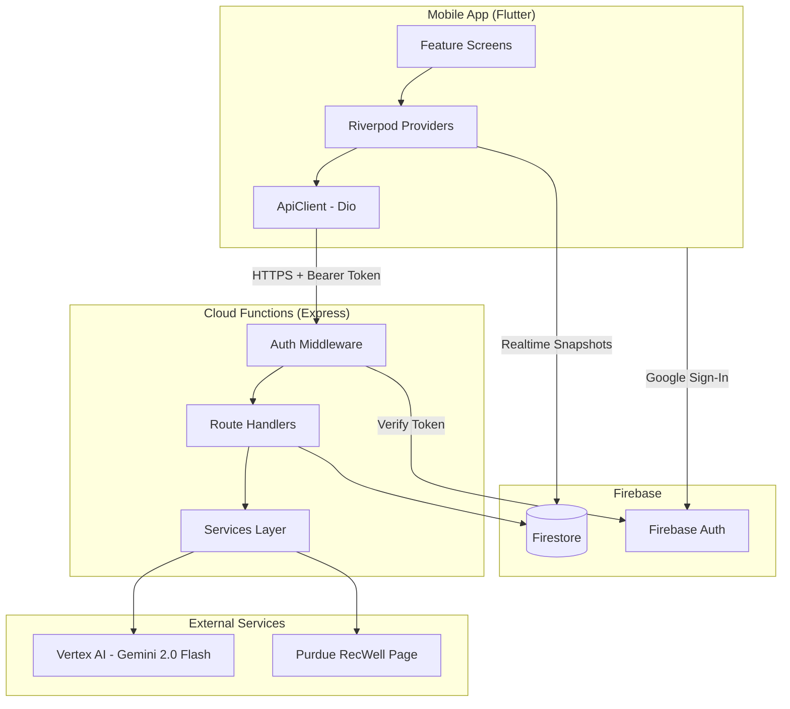
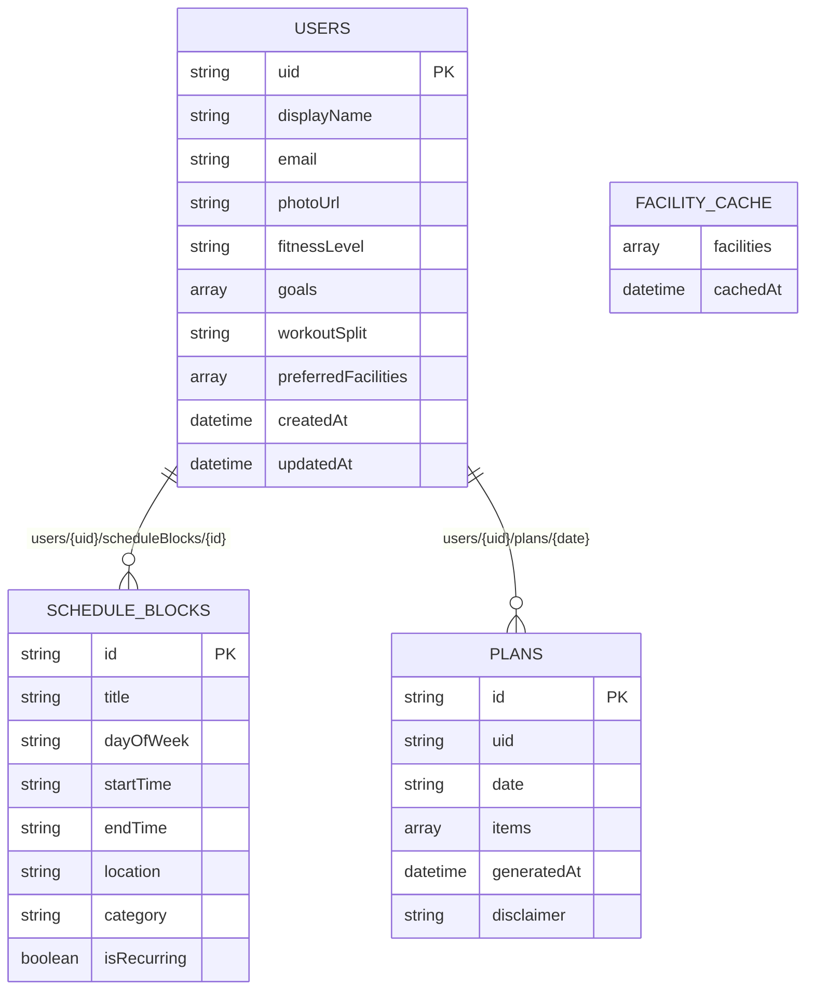

# Codebase Information

## Project Identity

- **Name:** Purdue Personal Trainer
- **Package name:** `purdue-personal-trainer`
- **Description:** AI-powered fitness planning for Purdue University students
- **Firebase Project:** `scab-purdue`
- **Region:** `us-central1`

## Monorepo Structure

This is a pnpm workspace monorepo with three packages:

| Package | Path | Language | Runtime |
|---------|------|----------|---------|
| Mobile App | `apps/mobile/` | Dart (Flutter) | Android/iOS/Web/macOS |
| Cloud Functions | `functions/` | TypeScript | Node.js 20 |
| Shared Schemas | `packages/shared/` | TypeScript | Library (compiled) |

## Technology Stack

### Mobile App (`apps/mobile/`)
- **Framework:** Flutter 3.24+, Dart SDK ≥3.5.0
- **State Management:** Riverpod (flutter_riverpod + riverpod_annotation)
- **Routing:** GoRouter (declarative, auth-aware redirects)
- **Networking:** Dio (HTTP client with auth interceptor)
- **Firebase SDKs:** firebase_core, firebase_auth, cloud_firestore, cloud_functions
- **Auth:** Google Sign-In + Firebase Auth
- **Code Gen:** freezed, json_serializable, riverpod_generator, build_runner
- **UI:** Material 3

### Cloud Functions (`functions/`)
- **Runtime:** Node.js 20
- **Framework:** Express 4 + firebase-functions v2
- **AI:** Vertex AI SDK (`@google-cloud/vertexai`) — Gemini 2.0 Flash model
- **Validation:** Zod schemas (from `@ppt/shared`)
- **Scraping:** axios + cheerio (facility usage)
- **Calendar Parsing:** node-ical (ICS import)
- **Testing:** Vitest
- **Linting:** ESLint 9 + Prettier

### Shared Package (`packages/shared/`)
- **Purpose:** Single source of truth for data schemas and Firestore collection paths
- **Validation Library:** Zod
- **Exports:** Schema validators, TypeScript types, collection path constants, cache TTL

## Build & Package Management

- **Workspace Manager:** pnpm 9.15.4
- **Monorepo Config:** `pnpm-workspace.yaml` (includes `functions/` and `packages/*`)
- **Flutter:** standalone (pubspec.yaml, not in pnpm workspace)
- **TypeScript:** tsc with project references
- **Internal Dependency:** `@ppt/functions` depends on `@ppt/shared` via `workspace:*`

## CI/CD (GitHub Actions)

Two workflows triggered on push/PR to `main`:

1. **`functions.yml`** — Lint, typecheck, test for `functions/` and `packages/shared/`
2. **`flutter.yml`** — `flutter analyze` + `flutter test` for `apps/mobile/`

## Firebase Configuration

- **Functions:** Single codebase, `us-central1`, predeploy runs lint + build
- **Firestore:** Rules + indexes configured
- **Emulators:** Auth (9099), Functions (5001), Firestore (8080), UI (4000)

## Architecture Pattern

## Firestore Data Model

## API Endpoints

| Method | Path | Auth | Description |
|--------|------|------|-------------|
| GET | `/api/health` | No | Health check |
| GET | `/api/facility-usage` | No | RecWell facility occupancy (5-min cache) |
| POST | `/api/plan/generate` | Yes | Generate daily workout plan |
| POST | `/api/chat` | Yes | Chat with AI fitness assistant |
| POST | `/api/schedule/import-ics` | Yes | Import ICS calendar file |

## Key Design Decisions

- **Gemini server-side only:** API keys/credentials never leave Cloud Functions
- **Zod as schema source of truth:** Shared between functions; Dart models mirror these manually
- **Facility usage caching:** 5-minute TTL in Firestore to avoid excessive scraping
- **Rule-based plan generation (Phase 1):** Deterministic scheduling with Gemini as Phase 2 upgrade
- **Auth middleware:** Firebase ID token verification on protected routes
- **Riverpod over BLoC:** Chosen for simpler API and compile-time safety
