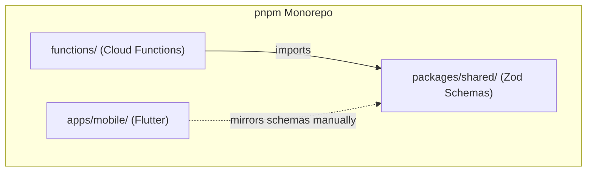

# Components

**Tags:** `#components` `#modules` `#responsibilities` `#directory-map`

## Package Overview

---

## 1. Mobile App (`apps/mobile/`)

### Entry Point
- `lib/main.dart` — Initializes Firebase, wraps app in `ProviderScope`
- `lib/app/app.dart` — Root `MaterialApp.router` with GoRouter and theme

### Features (`lib/features/`)

| Feature | File | Responsibility |
|---------|------|----------------|
| Auth | `auth/login_screen.dart` | Google Sign-In UI, emulator sign-in for dev |
| Onboarding | `onboarding/onboarding_screen.dart` | Multi-step profile setup (fitness level, goals, schedule) |
| Home | `home/home_screen.dart` | Bottom navigation shell (Today, Schedule, Chat, Profile tabs) |
| Today | `today/today_tab.dart` | Display daily plan + facility usage, trigger plan generation |
| Schedule | `schedule/schedule_tab.dart` | List of schedule blocks by day |
| Schedule | `schedule/schedule_edit_screen.dart` | Add/edit schedule block form |
| Schedule | `schedule/schedule_screen.dart` | Navigation wrapper |
| Chat | `chat/chat_tab.dart` | AI chat interface with message history |
| Profile | `profile/profile_tab.dart` | View/edit user profile, sign out |

### Providers (`lib/providers/`)

| Provider | Type | Purpose |
|----------|------|---------|
| `authStateProvider` | `StreamProvider<User?>` | Firebase auth state stream |
| `currentUserProvider` | `Provider<User?>` | Synchronous current user |
| `authServiceProvider` | `Provider<AuthService>` | Sign-in/sign-out operations |
| `userProfileProvider` | `AsyncNotifierProvider` | User profile from Firestore |
| `scheduleBlocksProvider` | `StreamProvider` | Realtime schedule blocks |
| `scheduleServiceProvider` | `Provider<ScheduleService>` | Schedule CRUD operations |
| `planProvider` | `AsyncNotifierProvider` | Today's plan (load + generate) |
| `chatMessagesProvider` | `StateNotifierProvider` | Chat message list + send |
| `facilityUsageProvider` | `FutureProvider` | Facility usage from API |
| `apiClientProvider` | `Provider<ApiClient>` | Shared Dio HTTP client |
| `themeProvider` | Generated (riverpod_generator) | Theme mode state |

### Services (`lib/services/`)
- `api_client.dart` — Dio HTTP client with `_AuthInterceptor` (auto Bearer token)

### Shared (`lib/shared/`)
- `routing/router.dart` — GoRouter configuration with auth/onboarding redirects
- `theme/theme.dart` — Material 3 theme (purple/gold Purdue colors)
- `utils/category_icons.dart` — Icon mapping for schedule categories

### Models (`lib/models/`)
- `user_profile.dart` — Mirrors `UserProfile` Zod schema
- `schedule_block.dart` — Mirrors `ScheduleBlock` Zod schema
- `daily_plan.dart` — Mirrors `DailyPlan` + `PlanItem` Zod schemas
- `facility_usage.dart` — Mirrors `FacilityUsageItem` Zod schema
- `chat_message.dart` — Mirrors `ChatMessage` Zod schema

---

## 2. Cloud Functions (`functions/`)

### Entry Point
- `src/index.ts` — Initializes Firebase Admin, exports `api` Cloud Function (onRequest v2)
- `src/app.ts` — Express app with CORS, JSON body parser, route mounting, 404 fallback

### Routes (`src/routes/`)

| File | Mount Point | Responsibility |
|------|-------------|----------------|
| `facility-usage.ts` | `/api/facility-usage` | GET handler; checks Firestore cache, scrapes on miss |
| `plan.ts` | `/api/plan` | POST `/generate`; validates input, runs plan generator, persists |
| `chat.ts` | `/api/chat` | POST `/`; loads user context, calls Gemini, returns reply |
| `ics-import.ts` | `/api/schedule` | POST `/import-ics`; fetches + parses ICS URL |

### Middleware (`src/middleware/`)
- `auth.ts` — `requireAuth` middleware: verifies Firebase ID token, attaches `uid` to request

### Services (`src/services/`)

| File | Responsibility |
|------|----------------|
| `gemini.ts` | Calls Vertex AI Gemini 2.0 Flash with system prompt, user context, conversation history |
| `plan-generator.ts` | Rule-based daily plan: finds free slots in schedule, suggests workouts based on fitness level/split |
| `facility-scraper.ts` | Scrapes Purdue RecWell facility usage page via axios + cheerio |
| `ics-parser.ts` | Parses ICS content via node-ical, expands recurring events up to 6 months |

### Tests (`test/`)
- `ics-parser.test.ts` — Unit tests for ICS parsing (single events, recurring, edge cases)
- `plan-generator.test.ts` — Unit tests for plan generation logic

---

## 3. Shared Package (`packages/shared/`)

### Entry Point
- `src/index.ts` — Re-exports all schemas, types, and constants

### Core Files
- `src/schemas.ts` — All Zod schemas: `ScheduleBlock`, `UserProfile`, `DailyPlan`, `PlanItem`, `FacilityUsageItem`, `ChatMessage`, `ChatRequest`, `ChatResponse`, `IcsImportRequest`, `IcsEvent`, `IcsImportResponse`
- `src/schemas.test.ts` — Validation tests for all schemas

### Exports
- Zod schema objects (runtime validators)
- Inferred TypeScript types (compile-time)
- `Collections` constant: Firestore path helpers
- `FACILITY_CACHE_TTL_MS`: Cache TTL constant (5 minutes)

---

## Cross-References

- How these components interact → [architecture.md](architecture.md)
- API contracts between them → [interfaces.md](interfaces.md)
- Data flowing through them → [data_models.md](data_models.md)
- End-to-end feature flows → [workflows.md](workflows.md)
