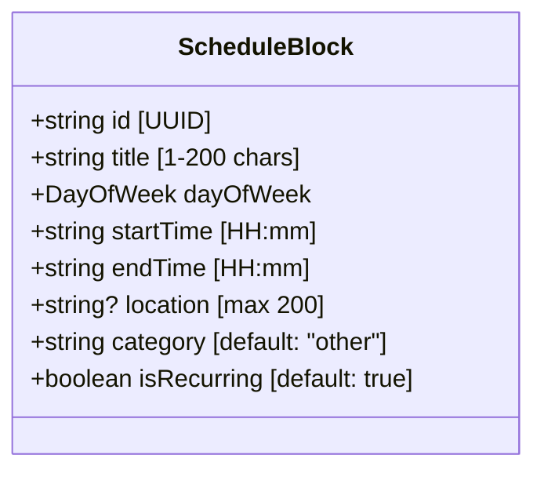
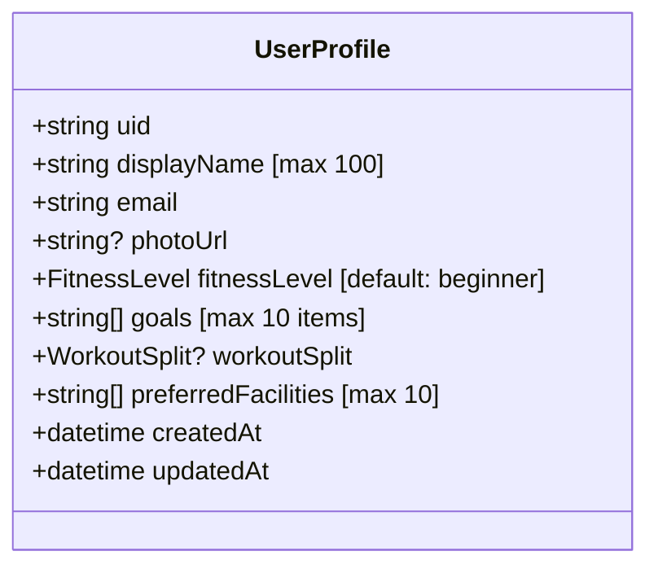
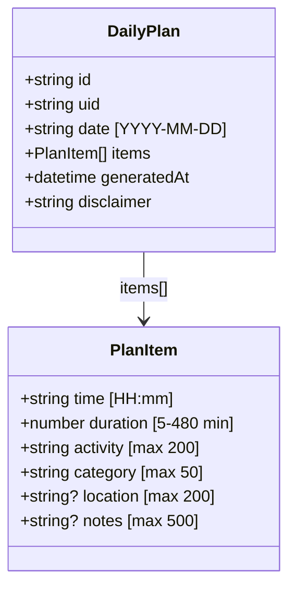
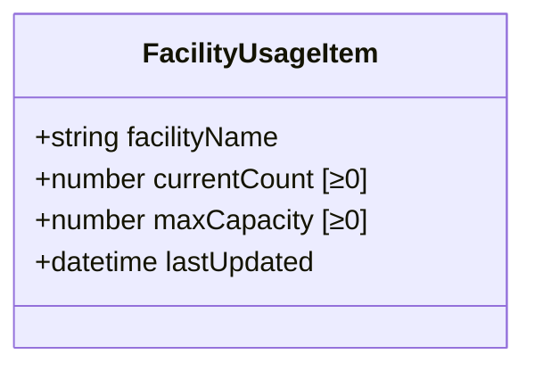
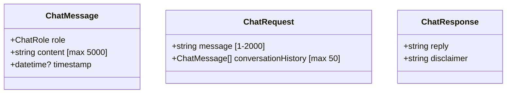
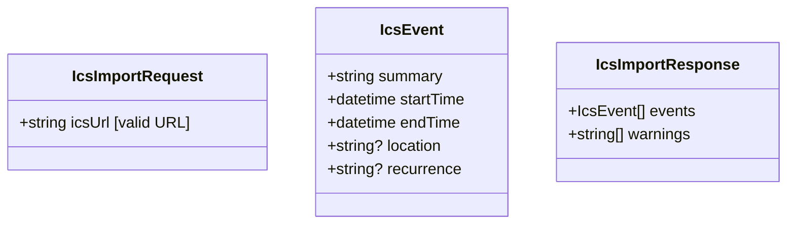
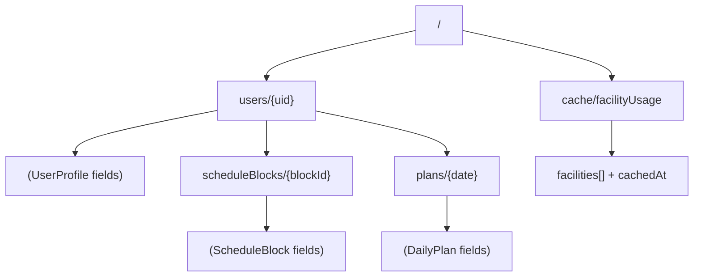

# Data Models

**Tags:** `#schemas` `#firestore` `#zod` `#dart-models` `#validation`

## Schema Authority

The **single source of truth** for all data structures is:
```
packages/shared/src/schemas.ts
```

Dart models in `apps/mobile/lib/models/` mirror these schemas manually. Changes to schemas must be reflected in both places.

---

## Zod Schemas (TypeScript)

### ScheduleBlock



**DayOfWeek enum:** `monday | tuesday | wednesday | thursday | friday | saturday | sunday`

**Firestore path:** `users/{uid}/scheduleBlocks/{id}`

---

### UserProfile



**FitnessLevel enum:** `beginner | intermediate | advanced | athlete`

**WorkoutSplit enum:** `ppl | upper_lower | full_body | bro_split`

**Firestore path:** `users/{uid}`

---

### DailyPlan & PlanItem



**Firestore path:** `users/{uid}/plans/{date}`

---

### FacilityUsageItem



**Firestore path:** `cache/facilityUsage` (field: `facilities[]`)

---

### Chat Models



**ChatRole enum:** `user | assistant`

Chat messages are not persisted to Firestore (kept in client memory only via `StateNotifier`).

---

### ICS Import Models



---

## Firestore Structure



### Collection Paths (from `@ppt/shared`)

```typescript
export const Collections = {
  USERS: "users",
  SCHEDULE_BLOCKS: (uid: string) => `users/${uid}/scheduleBlocks`,
  PLANS: (uid: string) => `users/${uid}/plans`,
  FACILITY_CACHE: "cache/facilityUsage",
};
```

### Security Rules Summary

| Path | Read | Write |
|------|------|-------|
| `users/{uid}` | Owner only | Owner only |
| `users/{uid}/scheduleBlocks/{id}` | Owner only | Owner only |
| `users/{uid}/plans/{id}` | Owner only | Owner only |
| `cache/{docId}` | Any authenticated user | Admin SDK only |
| Everything else | Denied | Denied |

---

## Constants

| Constant | Value | Location |
|----------|-------|----------|
| `FACILITY_CACHE_TTL_MS` | `300000` (5 min) | `packages/shared/src/index.ts` |
| Gemini model | `gemini-2.0-flash` | `functions/src/services/gemini.ts` |
| Gemini max tokens | `1024` | `functions/src/services/gemini.ts` |
| Gemini temperature | `0.7` | `functions/src/services/gemini.ts` |
| ICS fetch timeout | `15000ms` | `functions/src/routes/ics-import.ts` |
| ICS max size | `5MB` | `functions/src/routes/ics-import.ts` |
| Recurring event horizon | `6 months` | `functions/src/services/ics-parser.ts` |

---

## Cross-References

- How models flow through APIs → [interfaces.md](interfaces.md)
- Which components own which models → [components.md](components.md)
- End-to-end data flow → [workflows.md](workflows.md)
