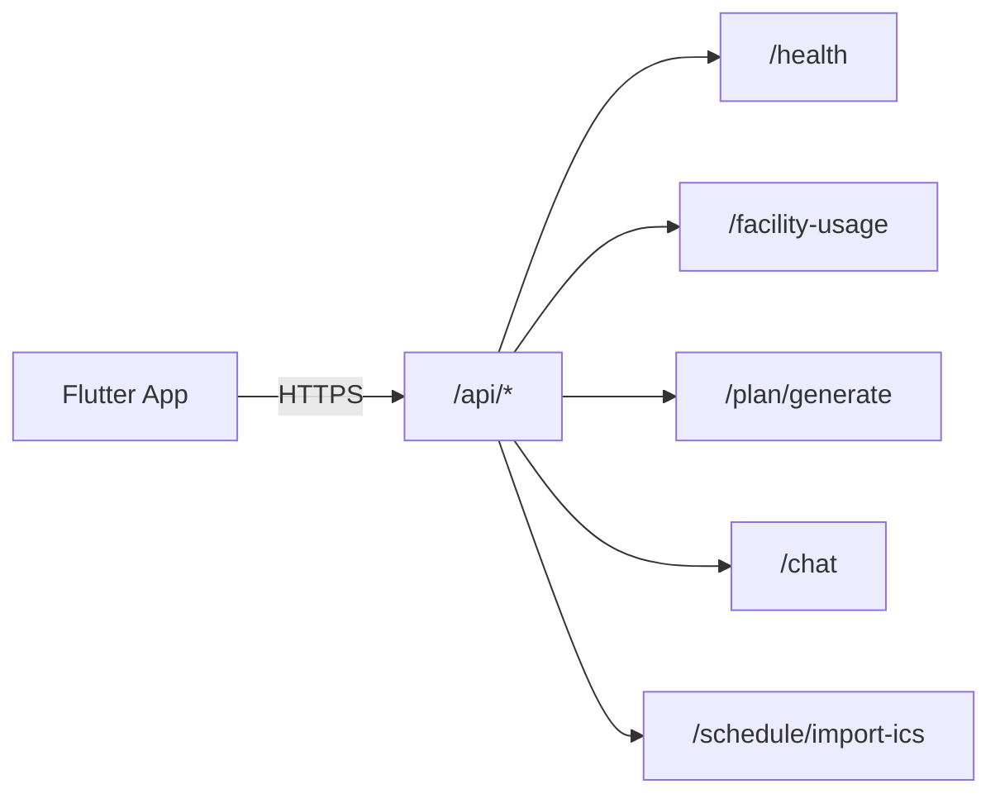

# Interfaces

**Tags:** `#api` `#endpoints` `#contracts` `#auth` `#http`

## API Overview

All endpoints are served by a single Cloud Function at:
- **Emulator:** `http://localhost:5001/scab-purdue/us-central1/api`
- **Production:** `https://us-central1-scab-purdue.cloudfunctions.net/api`



---

## Authentication

Protected endpoints require a Firebase ID token:

```
Authorization: Bearer <firebase-id-token>
```

The `requireAuth` middleware:
1. Extracts token from `Authorization` header
2. Verifies via `admin.auth().verifyIdToken()`
3. Attaches `uid` to request object
4. Returns `401` if missing, malformed, or expired

---

## Endpoints

### GET /api/health

**Auth:** None

**Response:**
```json
{ "status": "ok", "timestamp": "2024-01-01T00:00:00.000Z" }
```

---

### GET /api/facility-usage

**Auth:** None

**Description:** Returns current Purdue RecWell facility occupancy. Uses Firestore cache with 5-minute TTL.

**Response (200):**
```json
{
  "facilities": [
    {
      "facilityName": "CoRec Main Gym",
      "currentCount": 145,
      "maxCapacity": 300,
      "lastUpdated": "2024-01-01T12:00:00.000Z"
    }
  ],
  "cachedAt": "2024-01-01T12:00:00.000Z",
  "fromCache": true
}
```

**Error (500):**
```json
{ "error": "Failed to fetch facility usage data" }
```

---

### POST /api/plan/generate

**Auth:** Required (Bearer token)

**Request Body:**
```json
{
  "profile": {
    "uid": "abc123",
    "displayName": "Test User",
    "email": "test@purdue.edu",
    "fitnessLevel": "intermediate",
    "goals": ["build muscle", "improve cardio"],
    "workoutSplit": "ppl",
    "preferredFacilities": ["CoRec"],
    "createdAt": "2024-01-01T00:00:00.000Z",
    "updatedAt": "2024-01-01T00:00:00.000Z"
  },
  "scheduleBlocks": [
    {
      "id": "uuid-here",
      "title": "CS 251",
      "dayOfWeek": "monday",
      "startTime": "09:30",
      "endTime": "10:20",
      "location": "LWSN B134",
      "category": "class",
      "isRecurring": true
    }
  ],
  "date": "2024-03-15"
}
```

**Validation:** Uses `UserProfile`, `ScheduleBlock` Zod schemas + date regex.

**Response (200):** `DailyPlan` object (see [data_models.md](data_models.md))

**Errors:**
- `400` — Invalid request body (Zod validation failure)
- `401` — Missing/invalid auth token
- `500` — Plan generation failed

---

### POST /api/chat

**Auth:** Required (Bearer token)

**Request Body:**
```json
{
  "message": "What's the best time to go to the CoRec today?",
  "conversationHistory": [
    { "role": "user", "content": "Hi", "timestamp": "..." },
    { "role": "assistant", "content": "Hello! How can I help?", "timestamp": "..." }
  ]
}
```

**Validation:** `ChatRequest` schema (message: 1-2000 chars, history: max 50 messages)

**Server behavior:**
1. Loads user context (profile, schedule blocks, today's plan, facility usage) from Firestore
2. Passes to Gemini with system instruction and conversation history
3. Returns AI response

**Response (200):**
```json
{
  "reply": "Based on the current facility data, the CoRec is least busy between 2-4pm...",
  "disclaimer": "I'm an AI fitness assistant. My responses are not medical advice."
}
```

**Errors:**
- `400` — Invalid request body
- `401` — Missing/invalid auth token
- `500` — Gemini call failed

---

### POST /api/schedule/import-ics

**Auth:** Required (Bearer token)

**Request Body:**
```json
{
  "icsUrl": "https://www.purdue.edu/registrar/students/scheduling/myPurduePlan.ics"
}
```

**Validation:** `IcsImportRequest` schema (valid URL)

**Server behavior:**
1. Fetches ICS file from URL (max 5MB, 15s timeout)
2. Parses with node-ical
3. Expands recurring events up to 6 months
4. Returns normalized events

**Response (200):**
```json
{
  "events": [
    {
      "summary": "CS 251 - Data Structures",
      "startTime": "2024-01-15T09:30:00.000Z",
      "endTime": "2024-01-15T10:20:00.000Z",
      "location": "LWSN B134",
      "recurrence": "FREQ=WEEKLY;BYDAY=MO,WE,FR"
    }
  ],
  "warnings": []
}
```

**Errors:**
- `400` — Invalid request body
- `401` — Missing/invalid auth token
- `502` — Failed to fetch ICS file from URL

---

## Client-Side Interfaces

### ApiClient (Dart)

Location: `apps/mobile/lib/services/api_client.dart`

- Wraps Dio with base URL configuration
- `_AuthInterceptor` auto-attaches Firebase ID token to every request
- Base URL configurable via `API_BASE_URL` build environment variable
- Default (emulator): `http://10.0.2.2:5001/scab-purdue/us-central1/api`

### Firestore Realtime Listeners

The Flutter app uses direct Firestore SDK for realtime data:
- `scheduleBlocksProvider` — `StreamProvider` listening to `users/{uid}/scheduleBlocks`
- `userProfileProvider` — Reads `users/{uid}` document
- `planProvider` — Reads `users/{uid}/plans/{today}`

These bypass the Cloud Functions layer entirely for read operations.

---

## Cross-References

- Data schema details → [data_models.md](data_models.md)
- End-to-end request flows → [workflows.md](workflows.md)
- Component that implements each endpoint → [components.md](components.md)
