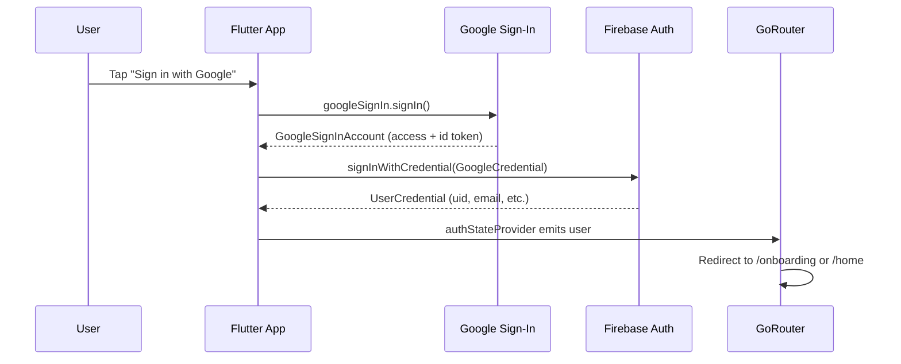
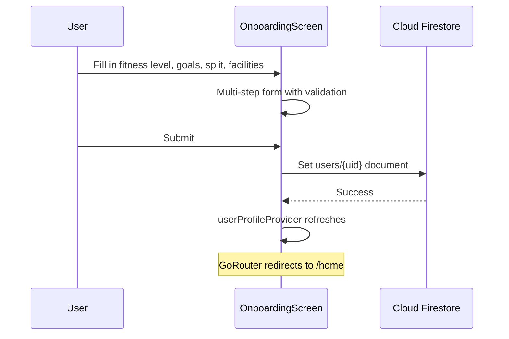
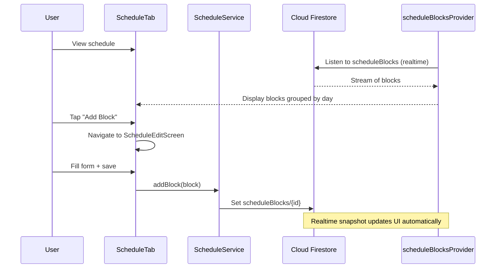
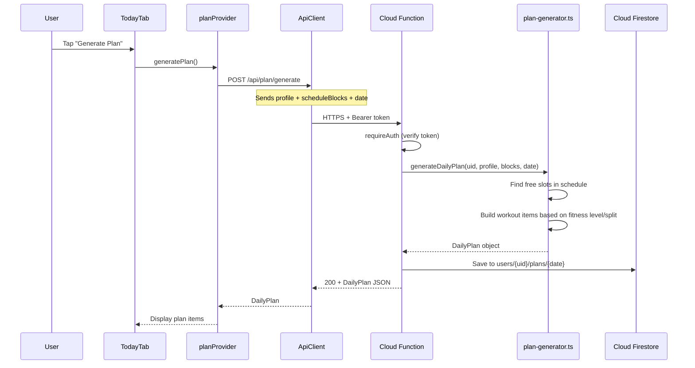
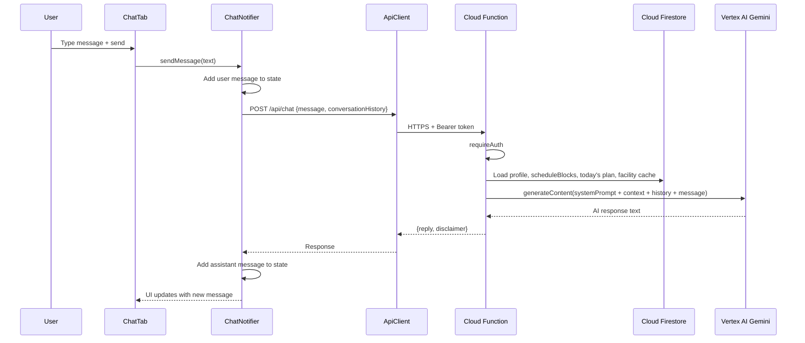
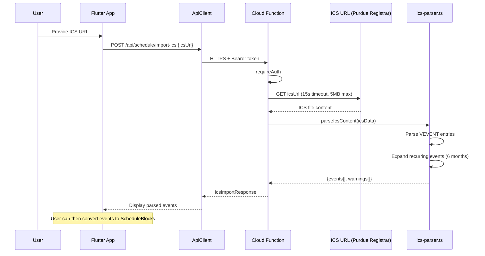
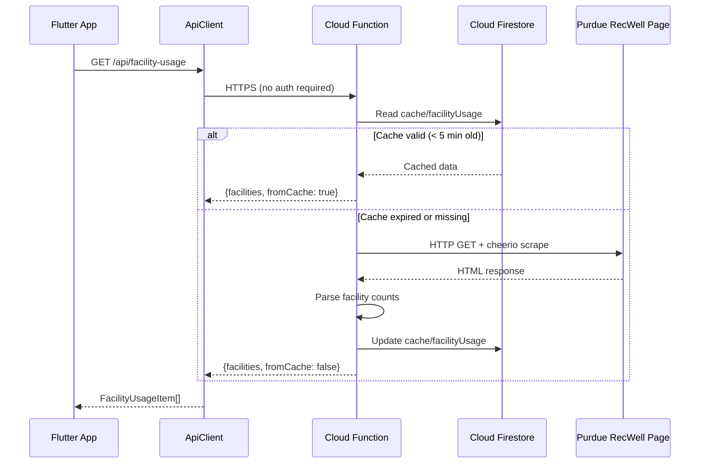
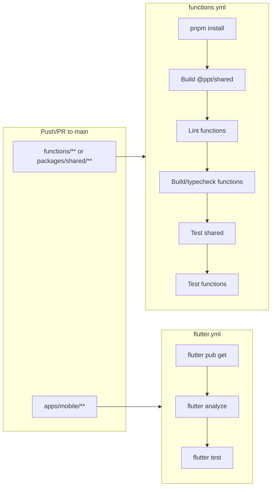

# Workflows

**Tags:** `#workflows` `#sequences` `#user-flows` `#feature-flows`

## 1. Authentication (Google Sign-In)

**Key points:**
- `authStateProvider` (StreamProvider) listens to `FirebaseAuth.authStateChanges()`
- GoRouter redirect logic: no auth → `/login`, no profile → `/onboarding`, else → `/home`
- Emulator mode uses `signInWithEmulator()` with email/password fallback

---

## 2. Onboarding (Profile Setup)

---

## 3. Schedule Management (CRUD)

---

## 4. Plan Generation

**Plan generation logic:**
1. Determine day of week from date
2. Filter schedule blocks to that day
3. Find free time slots (between 08:00–22:00)
4. For slots ≥60 min: suggest full workout (based on split + fitness level)
5. For slots 30–59 min: suggest quick cardio/stretching
6. If no early blocks: prepend 07:00 morning warm-up

---

## 5. AI Chat

**Gemini context injection:**
- System instruction defines role as Purdue fitness assistant with safety guardrails
- User context (profile, schedule, plan, facility data) injected as first message pair
- Conversation history maintained client-side (max 50 messages)

---

## 6. ICS Import

---

## 7. Facility Usage

---

## CI Workflows

---

## Cross-References

- API request/response details → [interfaces.md](interfaces.md)
- Component implementation details → [components.md](components.md)
- Data structures flowing through these workflows → [data_models.md](data_models.md)
